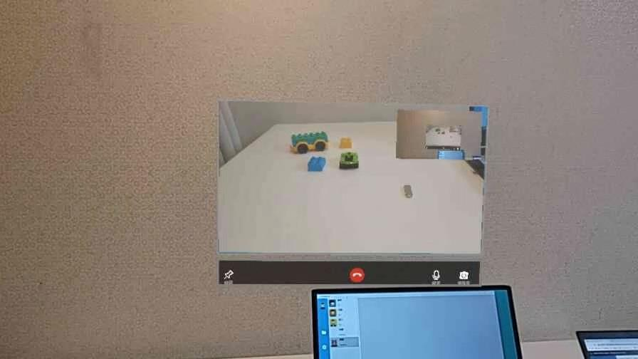
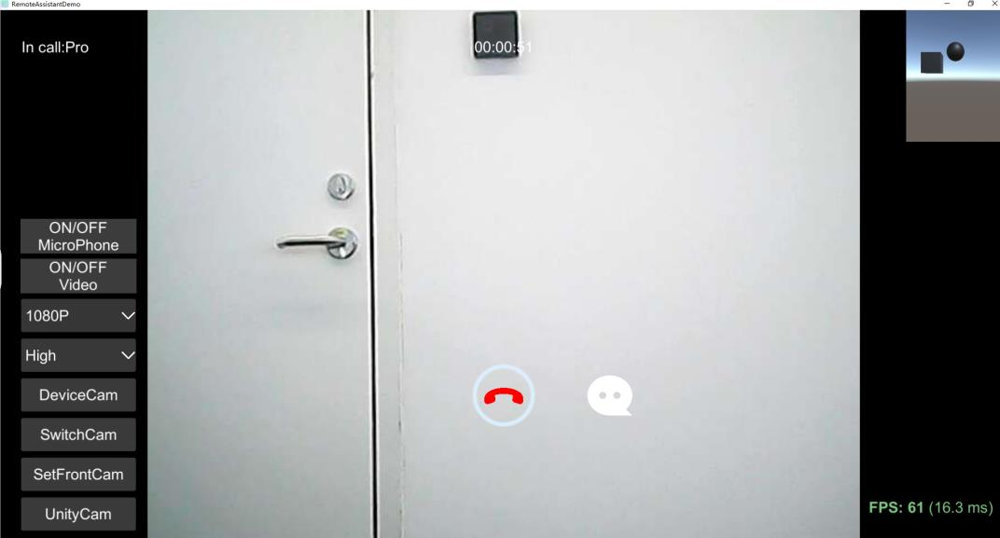

# Remote Assitant SDK

*English* ｜ [**中文**](README.zh.md)

## Description

> Remote Assitant SDK  supports UnityEditor,Android,iOS,Windows,UWP(Hololens1&2),MR/AR/VR Glasses...
> Multiple video types:device camera/unity camera/custom texture.
> The interface is simple, the video/audio capture and codec are separated, you can insert the sdk to your own network easily.

[Document](Readme/RemoteAssistantSDK.pdf)

## Features

- [x] Support Unity editor, Android, iOS, Windows/Mac/Linux, UWP.
- [x] Support multiple video types:device camera/unity camera/custom texture/pc screen.
- [x] Support VR,AR,MR video(htc/oculus/arfoundation/vuforia/hololens).
- [x] Support 180P (320x180), 360P (640x360), 720P (1280x720), 1080P (1920x1080) video resolution.
- [x] Support dynamically set video resolution and compression quality
- [x] Support one-to-one, one-to-many audio and video chat.
- [x] Support server record chat video.

## Latest Version Update
- SDK update to **v1.1.8**

## Register
Open the project->Unity top title bar->Tools>Register SDK

## APP Screenshots

