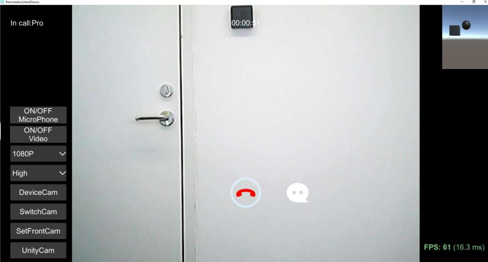

# 远程助手SDK

[**English**](README.md) ｜ *中文*

## 概述

> Remote Assistant SDK 支持 Unity编辑器,Android,iOS,Windows,UWP(Hololens1&2),MR/AR/VR 眼镜...
> 多种视频采集类型：设备摄像头/Unity摄像机/自定义纹理。
> 接口简单，将视频/音频捕获和编解码器分离，你可以将sdk轻松接入自己的网络中。

[文档](Readme/RemoteAssistantSDK.pdf)

## 特点

- [x] 支持Unity编辑器, Android, iOS, Windows/Mac/Linux, UWP平台。
- [x] 支持多种视频采集类型：设备摄像头/Unity摄像机/自定义纹理/PC屏幕。
- [x] 支持VR,AR,MR video(htc/oculus/arfoundation/vuforia/hololens)。
- [x] 支持的视频分辨率180P (320x180), 360P (640x360), 720P (1280x720), 1080P (1920x1080)。
- [x] 支持动态设置视频分辨率和压缩质量。
- [x] 支持一对一，一对多的音频和视频聊天。
- [x] 支持服务器录制聊天视频。

## 最新版本更新
- SDK更新到了**v1.1.8**

## 注册
打开工程->Unity顶部标题栏->Tools>Register SDK

## 截图

